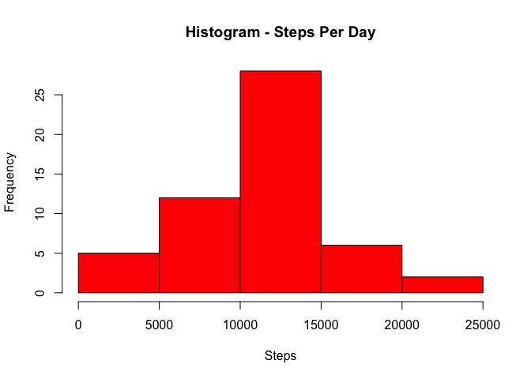
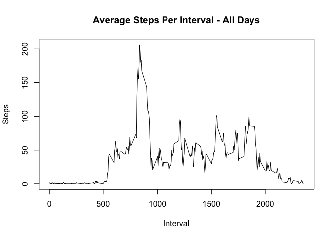
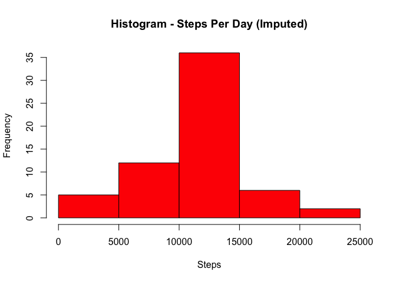
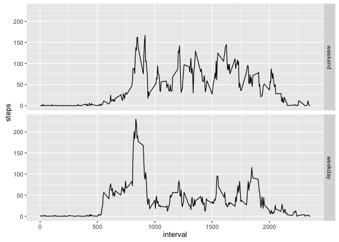

# Reproducible Research: Peer Assessment 1


## Loading and preprocessing the data

Unzip and load the data:

```r
unzip("activity.zip")
activity <- read.csv("activity.csv")
```

## What is mean total number of steps taken per day?

#### 1 - Steps per day

```r
dailySteps <- aggregate(steps ~ date, data = activity, FUN = sum)
```

#### 2 - Histogram

```r
  hist(dailySteps$steps, main = "Histogram - Steps Per Day", xlab = "Steps", col = "red")
```

\


#### 3 - Mean & Median

Mean:

```r
mean(dailySteps$steps)
```

```
## [1] 10766.19
```

Median:

```r
median(dailySteps$steps)
```

```
## [1] 10765
```

## What is the average daily activity pattern?

#### 1 - Time series plot of the interval and the average number of steps taken, averaged across all days


```r
stepsByInterval <- aggregate(steps ~ interval, data = activity, FUN = mean)
plot(stepsByInterval, type = "l", main = "Average Steps Per Interval - All Days", xlab = "Interval", ylab = "Steps")
```

\


#### 2 - Which 5-minute interval, on average across all the days in the dataset, contains the maximum number of steps?


```r
subset(stepsByInterval, steps == max(steps))
```

```
##     interval    steps
## 104      835 206.1698
```

## Imputing missing values

#### 1- Missing values in the dataset


```r
sum(is.na(activity$steps))
```

```
## [1] 2304
```

#### 2 - Strategy for filling in all of the missing values in the dataset

The missing values will be populated with the mean value across all days for that interval. The assumption here is that the activity for a given point in a day is likely to be common across all days (sleeping, going to work etc).

#### 3 - Create a new dataset that is equal to the original dataset but with the missing data filled in


```r
imputeStepsFromIntervalMean <- function(x) {
  if(is.na(x[1])) {
    return(as.numeric(stepsByInterval[stepsByInterval$interval == as.integer(x[3]),]$steps))
  } else {
    return(as.numeric(x[1]))
  }
}

imputedSteps <- apply(activity, 1, FUN = imputeStepsFromIntervalMean)
imputedActivity <- cbind(activity)
imputedActivity$steps <- imputedSteps
```

#### 4 - Histogram, Mean & Median for the Imputed Data


```r
imputedDailySteps <- aggregate(steps ~ date, data = imputedActivity, FUN = sum)
hist(imputedDailySteps$steps, main = "Histogram - Steps Per Day (Imputed)", xlab = "Steps", col = "red")
```

\

```r
mean(imputedDailySteps$steps)
```

```
## [1] 10766.19
```

```r
median(imputedDailySteps$steps)
```

```
## [1] 10766.19
```

The mean has remained the same between the original and imputed data. The median has risen slightly in the imputed data and now equals the mean.

## Are there differences in activity patterns between weekdays and weekends?


```r
library(ggplot2)
imputedActivity$weekday <- factor(weekdays(as.Date(imputedActivity$date)) %in% c("Monday", "Tuesday", "Wednesday", "Thursday", "Friday"), labels = c("weekend", "weekday"))
intervalByWeekday <- aggregate(steps ~ interval+weekday, data = imputedActivity, FUN = mean)
ggplot(data = intervalByWeekday, aes(interval, steps)) + geom_line() + facet_grid(weekday ~ .)
```

\
